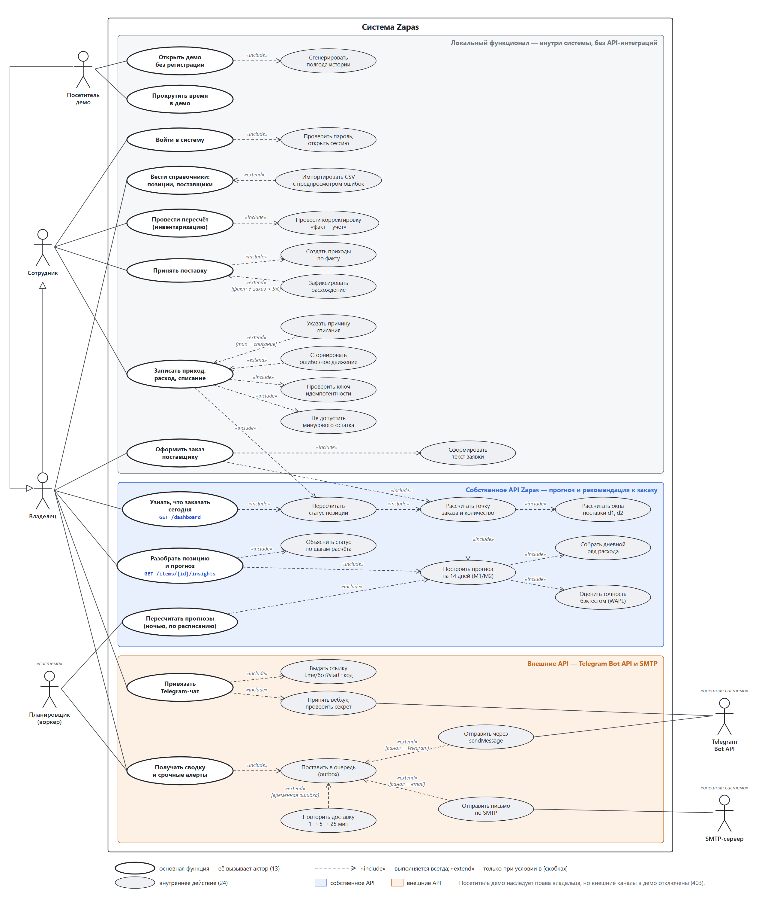

# Практическая работа №1. Формирование требований к бизнес-приложению

**Дисциплина:** Цифровые технологии для бизнеса (ВПК-7)\
**Студент:** Остапенко Виталий ________ , группа ________\
**Сервис:** Zapas — прогноз запасов для кофеен и кафе\
**Работающая версия:** <https://zapas.85.198.64.102.nip.io> (кнопка «Открыть демо» пускает без регистрации)

Сервис не придуман с нуля под эту работу: он уже написан и развёрнут.
Поэтому всё, что описано ниже, проверено на работающей системе. Примеры
ответов API сняты с неё 23.09.2026 (см. приложение А).

---

## 1. Цель сервиса

**Проблема.** Кофейня, пекарня или кафе на 1–5 точек заказывает продукты
«по ощущению». Молоко заканчивается посреди смены, а излишки портятся и
уходят в списание. Учётные системы вроде iiko, R-Keeper и Poster
показывают остаток, но не отвечают на вопрос «когда и сколько заказать».

**Что делает Zapas.** Ведёт склад, прогнозирует расход на 14 дней вперёд
и заранее говорит, что нужно заказать сегодня, у какого поставщика, в
каком количестве и до какого часа. Утром владелец получает сводку в
Telegram, а если позиция вот-вот закончится — срочное сообщение.

**Для кого.**

| Роль | Кто это | Что делает в системе |
|---|---|---|
| Владелец | собственник или управляющий | настраивает позиции и поставщиков, смотрит прогноз, оформляет заказы, получает уведомления |
| Сотрудник | бариста, повар, кладовщик | вносит расход и списания, проводит пересчёт, принимает поставки |
| Посетитель демо | тот, кто хочет посмотреть систему | всё то же, что владелец, во временной организации, плюс «промотка времени» |

**Результат для бизнеса.** Меньше дней, когда товара нет, и меньше
списаний. Владелец за минуту по экрану «Что заказать сегодня» или по
сообщению в Telegram понимает, чего хватит, что скоро закончится и
что заказать сегодня.

Основной цикл выглядит так: движения по складу → остаток → прогноз →
точка заказа → напоминание → заказ → приёмка → снова остаток.

---

## 2. Собственное API: прогноз расхода и рекомендация к заказу

### 2.1. Что делает функция

Главная функция сервиса — ответить по каждой позиции склада на вопрос
**«если не заказать сегодня, хватит ли до следующей поставки, и если нет —
сколько заказать»**. Функция доступна через веб-запросы (REST, JSON).
Весь контракт описан в `docs/api/openapi.yaml`: 42 операции, из них к
этой функции относятся три.

| Запрос | Что передаётся на вход | Что возвращается |
|---|---|---|
| `GET /api/v1/dashboard` | только сессия (организация определяется по ней) | счётчики по статусам, предложения к заказу по поставщикам с временем отсечки, полный список позиций со статусом и рекомендуемым количеством |
| `GET /api/v1/items/{id}/insights` | `id` позиции | прогноз на 14 дней с коридором, точность прогноза, история расхода за 60 дней, проекция остатка и разбор «почему такой статус» по шагам |
| `POST /api/v1/orders` | `supplier_id`; строки можно не передавать | черновик заказа поставщику, строки уже заполнены рекомендованным количеством, плюс готовый текст заявки |

**Кроме параметров запроса, функция использует данные, накопленные в сервисе:**

- историю движений по позиции — приход, расход, списания, пересчёты;
- текущий остаток и количество «в пути» по отправленным заказам;
- условия поставщика: срок поставки, дни доставки, время отсечки заказа,
  размер упаковки и минимальную партию;
- уровень сервиса позиции, например 95%: насколько надёжно нужно не
  допускать нехватки;
- текущую дату и часовой пояс организации.

### 2.2. Как считается результат

Расчёт идёт в пять шагов. Цифры ниже взяты из живого ответа по позиции
«Молоко 1,5%» в демо-кофейне.

1. **Ряд расхода.** Из журнала движений собирается расход по дням за 90
   дней. Дни, когда товара не было, исключаются: ноль продаж из-за
   пустой полки — это не спрос.
2. **Прогноз на 14 дней.** Используются две модели: M1 — среднее по
   одноимённым дням недели, M2 — экспоненциальное сглаживание с
   поправкой на день недели. Обе модели проверяются бэктестом на
   последних 28 днях, побеждает та, у которой меньше ошибка. Для
   молока выбрана M2: ошибка WAPE 13%, точность 87%, прогноз на
   сегодня 9,0 л, на завтра 10,5 л.
3. **Окна поставки.** Если заказать сегодня до 16:00, поставка придёт
   24.09 (d1). Если отложить заказ на день, придёт только 28.09 (d2),
   потому что поставщик возит не каждый день.
4. **Точка заказа и количество.**
   - потребность до d2: 50,513 л;
   - страховой запас z·σ·√n = 1,65 × 1,79 × √5 = 6,607 л
     (z = 1,65 соответствует уровню сервиса 95%);
   - целевой уровень: 50,513 + 6,607 = 57,120 л;
   - не хватает: 57,120 − 17,179 (остаток) = 39,941 л;
   - округляем вверх до упаковки поставщика (коробка 12 л):
     **4 коробки = 48 л**.
5. **Статус.** Без заказа молоко закончится 24.09, а если отложить заказ,
   следующая поставка придёт только 28.09. Статус — `order_today`:
   «заказать сегодня до 16:00».

Всего статусов пять: `out_of_stock` (нет в наличии), `critical`
(закончится раньше ближайшей поставки), `order_today` (заказать
сегодня), `ok`, `no_forecast` (истории пока мало для прогноза).

### 2.3. Пример ответа

`GET /api/v1/items/{id}/insights`, фрагмент (массивы сокращены):

```json
{
  "today": "2026-09-23",
  "item": {
    "name": "Молоко 1,5%", "base_unit": "l", "service_level": 95,
    "supplier_name": "Молочная ферма",
    "purchase_unit": "кор.", "unit_factor": "12.000"
  },
  "status": {
    "code": "order_today",
    "on_hand": "17.179", "on_order": "0.000",
    "stockout_date": "2026-09-24",
    "recommended_qty": "48.000", "purchase_qty": "4.000",
    "explanation": {
      "model": "M2", "need_until_d2": "50.513",
      "safety_stock": "6.607", "target_level": "57.120",
      "shortfall": "39.941", "d1": "2026-09-24", "d2": "2026-09-28",
      "order_by": "2026-09-23T16:00:00+03:00",
      "z": 1.65, "can_wait": false
    }
  },
  "accuracy": {
    "model": "M2", "accuracy": 0.87, "wape": 0.13, "window_days": 28
  },
  "forecast": [
    { "day": "2026-09-23", "qty": "9.003",
      "lower": "6.048", "upper": "11.958" },
    "… ещё 13 дней"
  ]
}
```

`GET /api/v1/dashboard` по той же демо-кофейне вернул 38 позиций: 2 нет в
наличии, 10 критичных, 15 нужно заказать сегодня, 11 в порядке.
Предложения к заказу сгруппированы по четырём поставщикам, у каждого
указано время отсечки: «Кофе-Импорт» — до 18:00, 9 строк; «Молочная
ферма» — до 16:00, 6 строк; «Сладкий дом» — до 20:00, 4 строки;
«Упак-Сервис» — до 12:00, 8 строк.

`POST /api/v1/orders` с одним `supplier_id` «Молочной фермы» собрал
черновик из шести строк. Строка по молоку 1,5% совпала с карточкой
позиции: 48 л. В ответе есть и готовый текст заявки:

```text
Заказ от «Кофейня «Демо»»

• Молоко 1,5% — 4 кор. (48 л)
• Молоко 3,2% — 10 кор. (120 л)
• Молоко кокосовое — 2 кор. (24 л)
• Молоко миндальное — 1 кор. (12 л)
• Молоко овсяное — 4 кор. (48 л)
• Сливки 33% — 1 кор. (6 л)
```

### 2.4. Правила контракта

- **Авторизация.** Сессия передаётся в httpOnly-cookie. Для изменяющих
  запросов нужен ещё заголовок `X-CSRF-Token`. Организация определяется
  только по сессии и никогда не берётся из URL или тела запроса: так
  одна кофейня не увидит данные другой.
- **Количества** передаются строками (`"48.000"`), а не дробными числами,
  чтобы не терять точность при округлении.
- **Повторная отправка.** `POST /orders` принимает заголовок
  `Idempotency-Key`: повторный запрос с тем же ключом не создаёт второй
  заказ.
- **Ошибки** возвращаются в формате RFC 9457 (`application/problem+json`).
  Чужой объект отдаёт 404, а не 403, чтобы по ответу нельзя было понять,
  что объект существует.

### 2.5. Как вызвать API со стороны, например из сервиса одногруппника

Регистрация не нужна: `POST /sandbox` заводит временную организацию с
полугодом истории и сразу открывает сессию. Демо живёт 24 часа; с одного
IP можно создать не больше 5 демо в час.

```bash
HOST=https://zapas.85.198.64.102.nip.io
curl -c jar.txt -X POST -H "Origin: $HOST" $HOST/api/v1/sandbox
curl -b jar.txt $HOST/api/v1/dashboard
```

---

## 3. Внешние API

Свой мессенджер и свою почтовую доставку писать бессмысленно: владелец
кофейни и так сидит в Telegram. Поэтому доставка уведомлений отдана
внешним сервисам, а вся бизнес-логика остаётся в Zapas.

| Внешний сервис | Зачем | Как взаимодействуем | Статус |
|---|---|---|---|
| **Telegram Bot API** | сводка и срочные алерты туда, где владелец и так читает сообщения | Zapas вызывает метод `sendMessage`; Telegram вызывает вебхук Zapas | реализовано |
| **SMTP-сервер** | второй канал, email | Zapas отправляет письмо по SMTP, таймаут 20 с | реализовано |

Адреса вызовов:

- исходящий: `POST https://api.telegram.org/bot<токен>/sendMessage`
  с телом `{"chat_id": …, "text": …}`;
- входящий: `POST /api/v1/telegram/webhook` — сюда Telegram присылает
  сообщения, которые пользователь пишет боту;
- ссылка для привязки чата: `t.me/<бот>?start=<код>`;
- SMTP: адрес сервера задаётся в настройках; при разработке письма
  ловит локальный Mailpit.

### 3.1. Привязка Telegram

1. Владелец нажимает в кабинете «Привязать Telegram» (`POST /api/v1/telegram/link`).
2. Zapas создаёт одноразовый код, который действует 15 минут, и
   возвращает ссылку `t.me/<бот>?start=<код>`.
3. Владелец открывает ссылку. Telegram присылает команду `/start <код>`
   на вебхук Zapas.
4. Zapas проверяет секретный заголовок `X-Telegram-Bot-Api-Secret-Token`
   (без него вебхук отвечает 403), находит код и сохраняет `chat_id`.
5. Бот отвечает в чат «Готово!». Командой `/stop` чат отвязывается.

В демо привязка закрыта: запрос возвращает 403 «В демо внешние каналы
отключены», чтобы посетители не могли рассылать сообщения от имени
сервиса.

### 3.2. Доставка уведомлений

1. **Событие.** Уведомление появляется в пяти случаях:
   - ежедневная сводка — по умолчанию в 09:00 по времени организации;
   - позиция стала критичной;
   - до отсечки осталось 2 часа, а заказ ещё не отправлен;
   - поставка опаздывает;
   - при приёмке расхождение больше 5%.
2. **Очередь (outbox).** Уведомление записывается в таблицу-очередь в той
   же транзакции, что и событие. Поэтому ответ API не ждёт Telegram, а
   если Telegram недоступен, приход товара всё равно сохранён.
3. **Отправка.** Фоновый обработчик каждые 30 секунд забирает очередь и
   вызывает внешний сервис. Ответ Telegram обрабатывается по-разному:

   | Ответ Telegram | Что делает Zapas |
   |---|---|
   | 200 | отмечает «отправлено» |
   | 400, 403 (чат не найден, бот заблокирован) | не повторяет, отмечает «не доставлено» |
   | 429, сетевая ошибка, таймаут 10 с | повторяет через 1, 5, 25 минут и далее, всего до 5 попыток |

4. **Тихие часы.** Срочные алерты с 22:00 до 08:00 откладываются до утра.
5. **Без дублей.** Ключ дедупликации не даёт отправить одно и то же
   уведомление дважды.

### 3.3. Что разумно подключить дальше

Это направления развития, а не текущая функциональность: в ТЗ они
отнесены за рамки первой версии.

| Внешний сервис | Что даст |
|---|---|
| API кассовой системы (iiko, Poster) | расход подтягивается из продаж автоматически, а не вносится вручную |
| Погода и календарь праздников | поправки к прогнозу на жару, выходные и праздники |
| Обмен с 1С | выгрузка заказов и приходов в бухгалтерию |

---

## 4. Локальный функционал

Всё, что ниже, работает внутри системы, без обращения к сторонним
сервисам.

| Функция | Что делает | Правила |
|---|---|---|
| Вход и сессии | вход по email и паролю, выход, профиль | сессия на сервере, cookie недоступна скриптам, защита от CSRF; две роли: владелец и сотрудник |
| Демо без регистрации | создаёт временную кофейню с полугодом истории, примерно за 1,6 с | живёт 24 часа, не больше 5 демо в час с одного IP; кнопки «+1 день» и «+7 дней» проматывают время |
| Справочники | позиции, категории, поставщики, условия закупки | позиция не удаляется, а архивируется; импорт из CSV с предпросмотром ошибок по строкам, «всё или ничего» |
| Движения по складу | приход, расход, списание с причиной | журнал неизменяемый, ошибка исправляется сторно; нельзя уйти в минус (ответ 409 с фактическим остатком); повторная отправка формы не создаёт дубль |
| Инвентаризация | пересчёт фактических остатков | при проведении создаётся корректировка «факт − учёт» |
| Заказы поставщикам | черновик → отправлен → принят или отменён | приёмка создаёт приходы одной транзакцией, расхождения сохраняются |
| Лента уведомлений | те же уведомления в интерфейсе | есть всегда, даже без Telegram и почты |
| Изоляция организаций | данные разных кофеен не смешиваются | проверка на уровне приложения и политики RLS в PostgreSQL |

Регистрации новых клиентов в текущей версии нет: это учебный проект, и
реальных клиентов у него пока нет. Учётная запись для разработки
создаётся локально командой `seed`. На работающем сервере в систему
заходят через демо.

---

## 5. Use-Case диаграмма



**Акторы.**

- **Сотрудник** вносит движения, пересчитывает и принимает поставки.
- **Владелец** наследует всё, что умеет сотрудник, и добавляет
  справочники, заказы, прогноз и уведомления.
- **Посетитель демо** наследует права владельца, но внешние каналы ему
  закрыты.
- **Планировщик** — системный актор: пересчитывает прогнозы ночью и
  запускает рассылку сводок.
- **Telegram Bot API** и **SMTP-сервер** — внешние системы.

**Группы функций** выделены цветом:

- серый блок — локальный функционал;
- синий блок — собственное API (прогноз и рекомендация к заказу);
- оранжевый блок — работа с внешними API.

**13 основных функций** — их напрямую вызывает актор:

| Группа | Функции |
|---|---|
| Локальный функционал | войти в систему; открыть демо без регистрации; прокрутить время в демо; вести справочники; записать приход, расход, списание; провести пересчёт; оформить заказ поставщику; принять поставку |
| Собственное API | узнать, что заказать сегодня; разобрать позицию и прогноз; пересчитать прогнозы ночью |
| Внешние API | привязать Telegram-чат; получать сводку и срочные алерты |

**24 внутренних действия** — их пользователь не вызывает напрямую:

| Группа | Действия |
|---|---|
| Локальный функционал | проверить пароль и открыть сессию; сгенерировать полгода истории; импортировать CSV с предпросмотром ошибок; провести корректировку «факт − учёт»; создать приходы по факту; зафиксировать расхождение; проверить ключ идемпотентности; указать причину списания; сторнировать ошибочное движение; не допустить минусового остатка; сформировать текст заявки |
| Собственное API | пересчитать статус позиции; рассчитать точку заказа и количество; рассчитать окна поставки d1, d2; построить прогноз на 14 дней; собрать дневной ряд расхода; оценить точность бэктестом; объяснить статус по шагам расчёта |
| Внешние API | выдать ссылку для привязки; принять вебхук и проверить секрет; поставить уведомление в очередь; отправить через sendMessage; отправить письмо по SMTP; повторить доставку с задержкой |

**Связи include и extend.** `«include»` означает, что действие
выполняется всегда. `«extend»` — только при условии, указанном в
квадратных скобках. Примеры с диаграммы:

- «Записать приход, расход, списание» **включает** проверку
  идемпотентности, запрет минусового остатка и пересчёт статуса
  позиции. Через пересчёт статуса локальная функция пользуется
  собственным API.
- «Указать причину списания» **расширяет** запись движения при условии
  `[тип = списание]`; «Сторнировать ошибочное движение» — тоже
  расширение.
- «Оформить заказ поставщику» **включает** расчёт точки заказа: строки
  заказа предзаполняются рекомендацией.
- «Поставить в очередь (outbox)» **расширяется** отправкой через Telegram
  или по SMTP в зависимости от канала, а при временной ошибке —
  повторной доставкой.

Всего на диаграмме 21 связь include и 7 связей extend.

---

## 6. Запись в общую Google-таблицу

| ФИО | Название сервиса | Краткое описание | Внешние API |
|---|---|---|---|
| Остапенко Виталий ________ | Zapas | Веб-сервис для кофеен и кафе: ведёт склад, прогнозирует расход на 14 дней и говорит, что, сколько и до какого часа заказать у поставщика; присылает утреннюю сводку и срочные алерты | Telegram Bot API (сводки, алерты, привязка чата через вебхук); SMTP (email); в планах — API кассы iiko/Poster |

---

## Приложение А. Проверка на работающем сервисе

Все проверки выполнены 23.09.2026 на <https://zapas.85.198.64.102.nip.io>
в демо-организации: реальные данные не затрагивались.

| Запрос | Результат |
|---|---|
| `POST /api/v1/sandbox` | 201 за 1,64 с, создана организация, открыта сессия |
| `GET /api/v1/dashboard` | 38 позиций; 2 нет в наличии, 10 критичных, 15 заказать сегодня, 11 в порядке; 4 поставщика в предложениях |
| `GET /api/v1/items/{id}/insights` (молоко 1,5%) | статус `order_today`, 48 л = 4 коробки; расчёт сходится по шагам из п. 2.2 |
| `POST /api/v1/orders` («Молочная ферма», без строк) | 201, черновик на 6 строк, текст заявки сформирован |
| `POST /api/v1/telegram/link` из демо | 403 «В демо внешние каналы отключены» |
| `POST /api/v1/telegram/webhook` без секрета | 403 |
